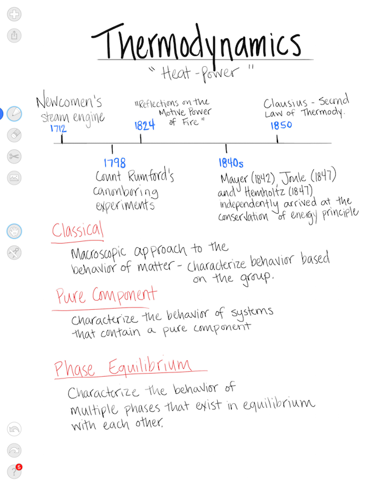

## Overview

The JotUI framework provides an OpenGL drawing view with primary goals of:

1. No lag during drawing
2. Easy to customize pen textures and colors
3. Low memory footprint
4. Undo/Redo support
5. Lots of control during drawing through view's delegate

The JotUI framework was originally built as part of [Loose Leaf](http://getlooseleaf.com) - a gesture-based note taking iPad app. More of pieces and frameworks from Loose Leaf are also [available as open source](https://getlooseleaf.com/opensource/).

## The JotView in Loose Leaf

The JotUI.framework is the drawing engine used in [Loose Leaf](http://getlooseleaf.com).

## Adding JotUI to Your Project

JotUI builds into a static framework that can be linked into your iOS app. The JotUI.workspace provides a sample project that shows JotUI fully integrated into an app.

1. In your workspace, add JotUI.framework to your main project's Link Binary With Libraries build phase
2. Copy the *.vsh and *.fsh files into your project's Copy Resources phase
3. Add `#import <JotUI/JotUI.h>`
4. Create a `JotView` and implement the `JotViewDelegate` protocol
5. Enjoy!

## Get Involved

Some great places to get involved and help make JotUI better for everyone:

 - [Issue #1](https://github.com/adamwulf/JotUI/issues/1) Find a solution to using glScissor with glPoints. The only option might be to swap points with quads and then compare gpu/cpu/memory performance between the two.
 - [Issue #2](https://github.com/adamwulf/JotUI/issues/2) Change synchronous glFinish/glFlush calls to use asynchronous glFence
 - [Issue #3](https://github.com/adamwulf/JotUI/issues/3) The current brush rotation only allows for the same rotation to be used through the entire stroke. Add an option to interpolate the rotation throughout the stroke, similar to how color and width are interpolated

JotUI includes a spacecommander as a submodule to help with keeping code style consistent. Please format all your code before submitting a PR by using the included format-all.sh and format-staged.sh scripts.

## Sample Application
The Xcode workspace includes a jotuiexample project that shows a fully functional integration of the JotUI framework. You can refer to this example for any questions about how to integrate into your app.

## License
The JotUI framework and sample code are provided under the MIT License.

## Support This Project
 - Follow [@adamwulf](http://twitter.com/adamwulf) on twitter.
 - Support this project and [download Loose Leaf](https://itunes.apple.com/us/app/loose-leaf/id625659452?mt=8&uo=4&at=10lNUI)
